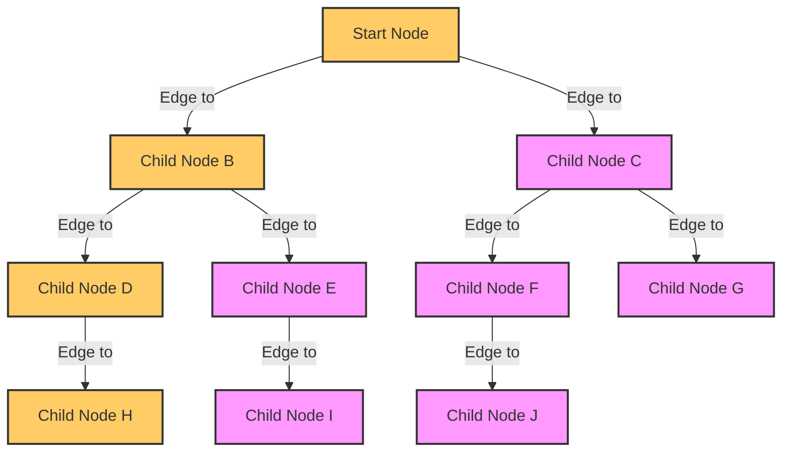

# Weiterführende Themen

## MERGE Statement

Das `MERGE`-Statement, oft auch als "Upsert"-Operation bezeichnet, ist ein SQL-Befehl, der es ermöglicht, mehrere
Schreibvorgänge – wie Einfügen, Aktualisieren und Löschen – in einer einzigen Operation zu kombinieren. Es wird
verwendet, um Daten in einer Zieltabelle basierend auf den Daten einer Quelltabelle zu aktualisieren oder einzufügen.
Die Grundlogik des `MERGE`-Statements ist:

- **MATCH**: Zuerst wird eine Übereinstimmung zwischen der Zieltabelle und der Quelltabelle auf Basis eines bestimmten
  Kriteriums (meist ein JOIN) gesucht.
- **UPDATE**: Wenn eine Übereinstimmung gefunden wird, werden die entsprechenden Daten in der Zieltabelle aktualisiert.
- **INSERT**: Wenn keine Übereinstimmung gefunden wird, werden die Daten aus der Quelltabelle in die Zieltabelle
  eingefügt.

Das `MERGE`-Statement ist besonders nützlich für die Synchronisation von zwei Tabellen und die Verwaltung von Änderungen
in Datenbanken, indem es ermöglicht, mehrere Operationen in einem effizienten, atomaren Prozess auszuführen.

## Trigger

Als Trigger bezeichnet man Prozeduren, die automatisch gestartet werden, sobald bestimmte Ereignisse eintreten. Dies
gilt für die drei möglichen Fälle Einfügen, Ändern und Löschen. Sie beziehen sich entweder auf Datenbankereignisse,
Tabellenereignisse oder Sichtenereignisse.

## Editable Views

Sichten sind nur unter bestimmten Bedingungen editierbar. Das liegt daran, dass Sichten meist aus mehreren Tabellen
zusammengeführt werden. Man hebt damit die Normalisierung der Daten wieder auf, um zu sachlich vollständigen Datensätzen
zu kommen. Solange diese Zusammenhänge eindeutig sind, können auch Sichten editiert werden. Meistens geht das nicht.

Um dieses Manko zu umgehen, werden Trigger genutzt, die die möglichen Fälle abdecken: Einfügen, Ändern und Löschen.
Die Programmierung innerhalb der Trigger stellt sicher, dass die Daten in ihrer Normalform in den entsprechnden Tabellen
auf Stand gehalten werden.

## Multitenancy

Multitenancy in Datenbanken bezieht sich auf eine Architektur, bei der eine einzige Instanz einer Datenbank-Software
mehrere Kunden (sogenannte "Tenants" oder Mieter) bedient. Jeder Tenant hat seine eigene, separate Datenmenge, die
unabhängig von den Daten der anderen Tenants gehalten wird, obwohl alle die gleiche Datenbank nutzen. Diese Art der
Architektur ist besonders häufig in Cloud-basierten Anwendungen und Diensten zu finden. Hier sind einige
Schlüsselelemente und Vorteile von Multitenancy:

1. **Ressourcenteilung:** Ein Hauptvorteil von Multitenancy ist die effiziente Nutzung von Ressourcen. Da die gleiche
   Datenbank und Infrastruktur von mehreren Tenants genutzt wird, können Kosten und Ressourcen (wie Speicherplatz,
   Rechenleistung) gespart werden.

2. **Isolierung und Sicherheit:** Obwohl die Datenbank von mehreren Tenants geteilt wird, ist es entscheidend, dass die
   Daten jedes Tenants sicher und isoliert von den anderen bleiben. Dies wird oft durch spezielle Sicherheits- und
   Isolationsmechanismen erreicht, wie etwa die Verwendung von Schemata, Views oder Datenbankrollen.

3. **Skalierbarkeit:** Multitenant-Datenbanken sind oft leichter skalierbar, da neue Tenants hinzugefügt werden können,
   ohne dass separate Datenbankinstanzen erstellt werden müssen. Dies erleichtert die Skalierung der Dienste und die
   Aufnahme neuer Kunden.

4. **Wartung und Updates:** In einer multitenanten Architektur können Wartungsarbeiten und Updates zentralisiert
   durchgeführt werden. Dies bedeutet, dass Änderungen oder Verbesserungen an der Datenbank einmal durchgeführt werden
   können und alle Tenants davon profitieren.

5. **Mandantenspezifische Anpassung:** Obwohl die Grundinfrastruktur für alle Tenants gleich ist, können Anpassungen und
   Konfigurationen spezifisch für einzelne Tenants vorgenommen werden, um deren individuelle Anforderungen zu erfüllen.

6. **Datentrennung:** In der Praxis kann die Trennung der Daten auf verschiedene Weisen erfolgen, z.B. durch separate
   Datenbanken, separate Schemata innerhalb einer Datenbank oder durch datenbankinterne Trennungsmechanismen, wie
   spezielle Schlüssel oder Tags, die die Daten jedes Tenants kennzeichnen.

Insgesamt ermöglicht Multitenancy in Datenbanken eine flexible, kosteneffiziente und sichere Möglichkeit, Dienste für
eine Vielzahl von Kunden über eine gemeinsame Plattform bereitzustellen.

## Selbstverweisende Tabellen

Eine selbst verweisende Tabelle ist eine Tabelle in einer Datenbank, in der ein oder mehrere Felder als Fremdschlüssel
auf die Primärschlüssel derselben Tabelle verweisen. Diese Struktur ermöglicht es, hierarchische oder rekursive
Beziehungen innerhalb derselben Tabelle darzustellen.

Typische Anwendungsfälle für selbst verweisende Tabellen sind:

1. **Hierarchische Datenstrukturen**: Zum Beispiel in einer Mitarbeiterdatenbank, wo jeder Mitarbeiter einen
   Vorgesetzten hat. Hier könnte ein "ManagerID"-Feld als Fremdschlüssel auf die "EmployeeID" in derselben Tabelle
   verweisen, um die hierarchische Beziehung zwischen Mitarbeitern und ihren Managern darzustellen.

2. **Baumstrukturen**: In Kategorien- oder Menüstrukturen, wo jede Kategorie eine übergeordnete Kategorie haben kann.
   Ein "ParentCategoryID"-Feld würde dann auf die "CategoryID" in derselben Tabelle verweisen.

3. **Netzwerkstrukturen**: In sozialen Netzwerken für die Darstellung von Beziehungen wie Freundschaften, Follower, etc.

Diese Art von Struktur erfordert oft spezielle Techniken und Abfragen, um die rekursiven Beziehungen effizient zu
verwalten und zu durchlaufen.

## Einfache Rekursion

-> Buch

## Depth first search

Beispiel UOM entwickeln

Artikel mit Maßeinheiten versehen
- Gewicht
- Preis
- Farbe

Lager, dass Artikel enthält.

Bestellungen werden von Kunden beauftragt.

Funktionen entwickeln, die eine Maßeinheit und Stückzahlen und diese umrechnen.

cm -> m = 100 -> 1

cm -> Preis = cm -> Gewicht -> Preis -> -> ->  

Umrechechnungsregeln bezogen auf den Artikel

create function calculate(anzahlStartUOM, startUOM, zielUOM) anzahlZielUOM

